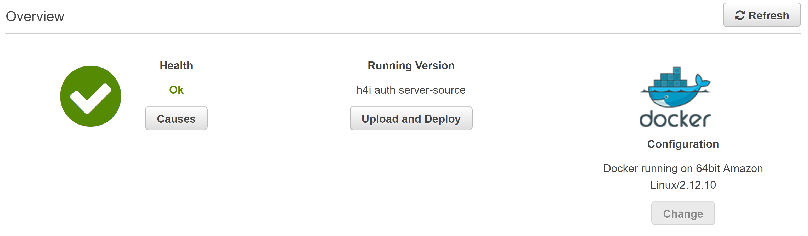
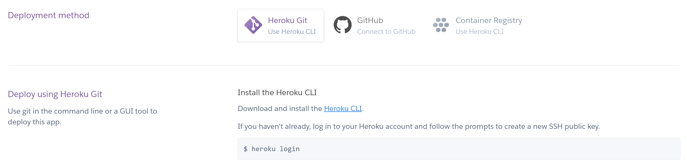
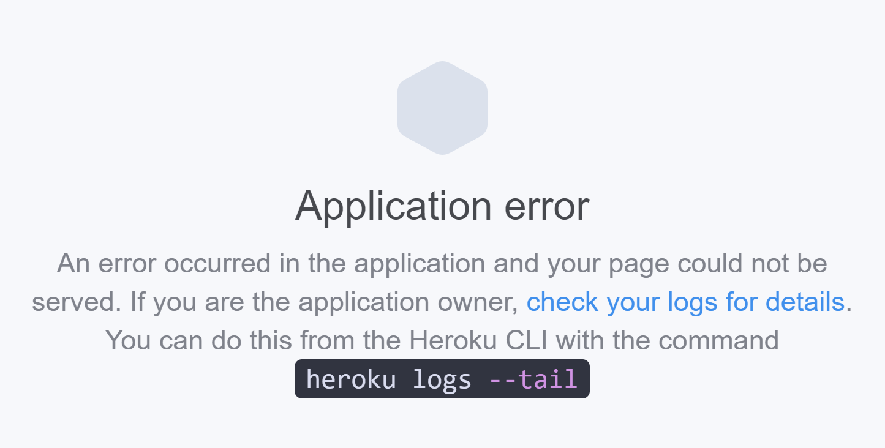
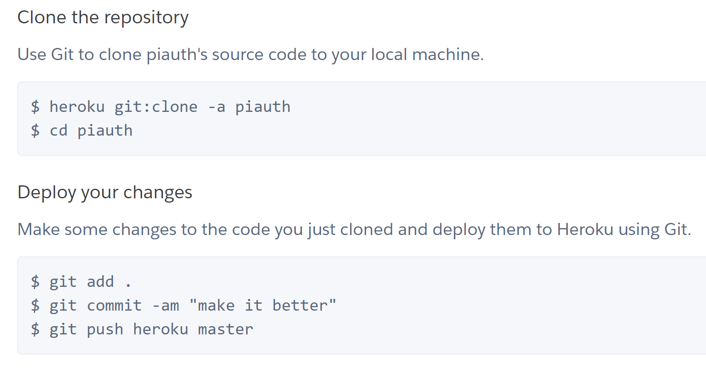

# YMCA Authentication Server

    ymca-auth.now.sh

Made from [H4i Infrastructure Authentication Server](https://github.com/hack4impact-uiuc/infra-authentication-server).

# Permission Structure

**admin** can promote or demote:
 - *intern*
 - *public*

**intern** can promote or demote:
 - *public*

**public** has no ability to promote or demote.

# Links

Documentation: https://www.notion.so/h4iuiuc/Authentication-Server-12c9fa26d1b9457bb84d7105caea530e

API: https://github.com/hack4impact-uiuc/infra-authentication-api/

Guide for integrating into your App: https://docs.google.com/document/d/1K6e9jarVtAync-Bti6BN6bKI-8JnvwK4IZmhlTSn2pg/edit

Client Example: https://github.com/hack4impact-uiuc/infra-authentication-client

# To Run Locally

```
yarn
yarn start
```

# Deployment

## AWS Elastic Beanstalk

1. Create an AWS account and go to the [Elastic Beanstalk website](https://console.aws.amazon.com/elasticbeanstalk/home) (note that you may be charged)
2. Create a new Elastic Beanstalk application, along with a web server environment
   
3. Select Docker as the configuration and upload Dockerized server code as a .zip file. Since there's a Dockerfile already, all you need to do is save the authentication server project folder as a zip file and upload it here.
   
4. After a few minutes (and resolving any potential errors), your server should be deployed
   

Tips:

- Remember to EXPOSE the server port in the Dockerfile by adding: `EXPOSE 8000`. You can replace `8000` with whatever local port you're using.
- Ensure the uploaded .zip contains the source code files directly (i.e. the Dockerfile should be visible as soon as the zip is uncompressed).
- Ensure the uploaded .zip contains your .env file

---

## AWS Amplify:

- [Amplify](https://aws-amplify.github.io/docs/) already has amazing documentation and detailed step-by-step instructions for how to set up
- Note that React applications must be created with [create-react-app](https://github.com/facebook/create-react-app)

---

## Heroku

1. Create a [Heroku account](https://www.heroku.com/) and [a new project](https://dashboard.heroku.com/apps).
2. Select a deployment method of your choice.
   - If you choose to use Heroku Git, you will have to install the [Heroku CLI tool](https://devcenter.heroku.com/articles/heroku-cli) and follow the given instructions to deploy your code to Heroku.
   - Alternatively, you can choose to use GitHub directly and link Heroku to your GitHub project.



Tips:

- In your startServer.js file, insert process.env.PORT as an additional port. Heroku uses a random port, so inserting this allows you to deploy both on Heroku and locally. For example, the following allows you to test your code locally on localhost:8000 while retaining the functionality of your Heroku deployment:

```
app.listen(process.env.PORT || 8000)
```



- Note that syncing changes using the CLI tool can be tedious if you are deploying mid-development, so it is recommended to deploy either at the very beginning or end. You have to clone the Heroku repository and make/commit your changes there for them to reflect on the deployment.
  
- You can turn the deployment offline/online with the following command:

```
Offline:
heroku ps:scale web=0

Online:
heroku ps:scale web=1
```

## Zeit Now

This server already comes preconfigured to work with Now, so minimal setup is needed.
Make sure that first you have [Now](https://zeit.co/download) installed on your machine. The current version as of writing this documentation is 15.0.8, and as it's in very rapid development, some of the instructions may change.

Once you create an account and log in via the CLI tool (using `now login`), you must add the secret keys from your environment file.

Open up your `.env` file. In a terminal window, execute the following command, replacing the email value with the email in the `.env` file:

```bash
now secrets add INFRA_EMAIL 'abc.def@gmail.com'
```

Repeat this for every other entry in the `.env` file, but replacing `INFRA_EMAIL` with `INFRA_CLIENT_ID`, `INFRA_CLIENT_SECRET`, etc. and their corresponding values. Make sure you include the single quotes in the command like above!

When you're ready to deploy, run `now` in the repo root and you will be given a link to your deployed docs.

Learn how to alias a deployment [here](https://zeit.co/docs/v2/domains-and-aliases/aliasing-a-deployment).

# DigitalOcean Setup

Note that much of the following is adapted from this [Medium.com](https://blog.machinebox.io/deploy-machine-box-in-digital-ocean-385265fbeafd) article, so please feel free to check that out if you would like additional clarification on any of these steps.

## Step 1: Digital Ocean Account and Token Creation

Head over to https://www.digitalocean.com/ and create an account for your project. You may need to enter in a credit card. Droplets generally begin at \$5/month.

Once you've done this, go ahead and create a personal access token.

[Insert image here]

Make sure to copy this down somewhere safe, as this will be hidden on the portal due to security reasons after creation.

## Step 2: Droplet Creation

In DigitalOcean, a "droplet" is essentially a mini virtual machine that generally runs some flavor of Linux and has its own IP address. You can almost think of it as your own, always on, SSH-only computer that has its IP address exposed to the world so people can access it anywhere, anytime.

Make sure that you have already installed [Docker](https://docs.docker.com/install/) on your computer. If you already have you can run

```bash
docker-machine --version
```

In order to make sure it's installed properly. We'll be using `docker-machine` to help us deploy to our droplet.

In the below command, be sure to replace `YOUR_TOKEN` with the access token you copied down from step 1, and `NAME_OF_MACHINE` with what you want to call your Droplet. This name choice is arbitrary, but we'll use it to let `docker-machine` know in the future which Droplet we want to install our Docker image to.

```bash
docker-machine create --digitalocean-size "s-1vcpu-1gb" --driver digitalocean --digitalocean-access-token YOUR_TOKEN NAME_OF_MACHINE
```

Once you run this command, it may take a bit for it to get everything set up. When it's done, run:

```
docker-machine ls
```

You should see the name of your machine and it should be running.

**IMPORTANT:** After running this, in order for the next commands to work, you **MUST** run the following, replacing `NAME_OF_MACHINE` with what you created:

```bash
eval $(docker-machine env NAME_OF_MACHINE)
```

This tells Docker to execute commands on your remote machine. If you open a new terminal tab or window, you will need to execute this again for the following steps to work.

When this is done, move on to the next step.

## Step 3: Build and Export Docker Image

Now that we've done this, we want to create the actual Docker image that we'll be using to run the server. If you already have a Docker image pushed up to a remote such as DockerHub, you can essentially skip this step. I don't recommend this, considering you will most likely have your `.env` file built with your Docker image, and that contains very sensitive information.

`cd` into your the root directory of the server that you set up using the CLI tool or manually configured.

Run the following, changing `DOCKER_IMAGE_NAME` to what you whatever you want to call this image:

```bash
docker build -t DOCKER_IMAGE_NAME .
```

Note, this may take a while, especially if you're running it for the first time. Subsequent builds will be much faster, as Docker caches assets that haven't changed since the previous build.

Once this is done, go ahead and run the following, replacing `DOCKER_IMAGE_NAME` with what you wrote in the previous step, and you can change `name_of_tar_file` to whatever you'd like.

```bash
docker save -o name_of_tar_file.tar DOCKER_IMAGE_NAME
```

This will essentially create a zipped up version of your image that you can then copy to another machine, which is exactly what we will do.

## Step 4: Running Docker on Remote Machine

Now that you have the local, zipped version of your Docker image from step 3, you're ready to proceed to transfer it to your remote machine.

Replace `name_of_tar_file` below with the name of the `.tar` file you created in the previous step.

```bash
docker image load < name_of_tar_file.tar
```

This will copy the image to your remote machine. Once you do this and it has completed successfully, run the following to spin up a container using your image:

```bash
docker run -d -p 80:8000 DOCKER_IMAGE_NAME
```

If successful, you'll get a hash back that gives you the id of the container.

Now, if you run `docker ps`, you should see one container that is currently running.

## Step 5: Verify It's Working

Great! If you got the above working, congratulations! You've finished deploying the application to DigitalOcean!  
Run, replacing `NAME_OF_MACHINE` with the name you created back in step 2:

```bash
docker-machine ip NAME_OF_MACHINE
```

To get the IP address of your DigitalOcean droplet. You should now be able to open up Postman and test your server using this IP!

Note that if you visit the IP in a web browser and you get a message that it `Cannot GET /`, this is normal as the endpoint may not be configured for GET requests on the default URL.
